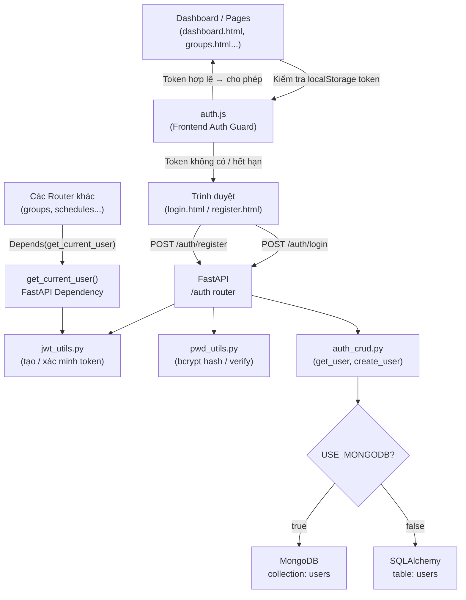
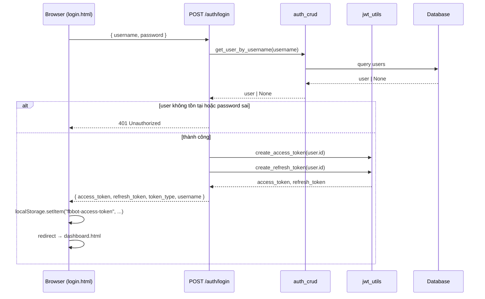
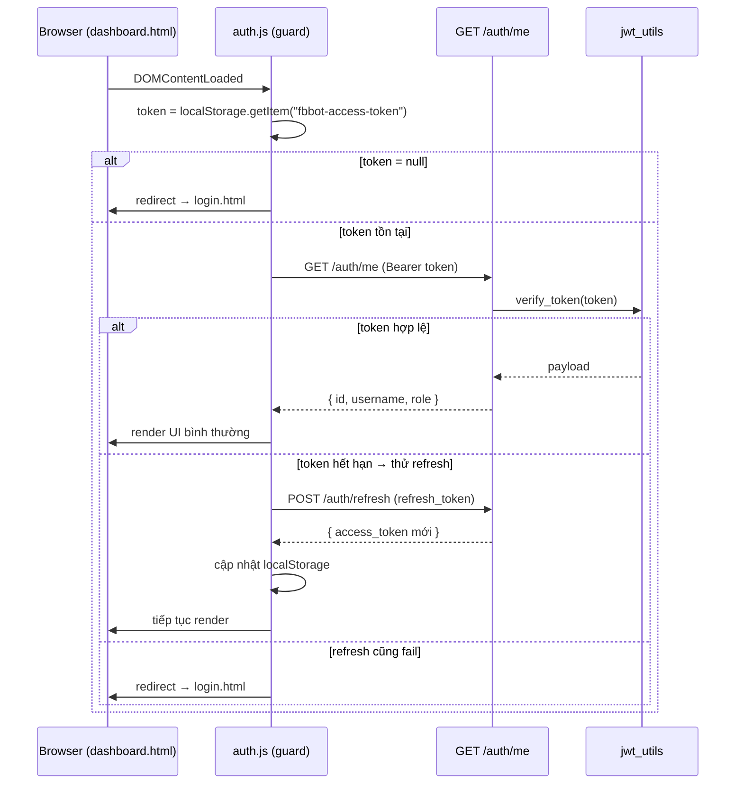

# Design Document: User Authentication

## Overview

Thêm chức năng đăng nhập / đăng ký tài khoản vào hệ thống FB Bot Console. Backend là FastAPI cung cấp các API `/auth/register`, `/auth/login`, `/auth/logout`, `/auth/refresh` với xác thực JWT (access token ngắn hạn + refresh token dài hạn). Frontend là hai trang HTML tĩnh (`login.html`, `register.html`) tích hợp hoàn toàn với design system glass morphism hiện có (tokens.css, base.css, components.css). Tất cả các route dashboard đều được bảo vệ — nếu chưa đăng nhập sẽ tự động redirect về `login.html`.

Hệ thống hỗ trợ cả hai database backend giống pattern hiện có: khi `USE_MONGODB=true` dùng MongoDB collection `users`, khi `false` dùng SQLAlchemy model `User` trên SQLite/PostgreSQL. Mật khẩu được hash bằng bcrypt qua passlib. Đăng ký public có thể bị tắt bằng biến môi trường `ALLOW_REGISTER=false` để chỉ admin mới được tạo user mới.


## Architecture




## Sequence Diagrams

### Luồng đăng nhập



### Luồng bảo vệ route dashboard




## Components and Interfaces

### Component 1: AuthRouter (`app/routers/auth.py`)

**Purpose**: Xử lý toàn bộ HTTP request liên quan đến xác thực người dùng.

**Interface** (Python):
```python
router = APIRouter(prefix="/auth", tags=["Xác thực"])

@router.post("/register", response_model=UserOut, status_code=201)
async def register(data: UserCreate, db=Depends(get_db)) -> UserOut: ...

@router.post("/login", response_model=TokenOut)
async def login(data: LoginRequest, db=Depends(get_db)) -> TokenOut: ...

@router.post("/refresh", response_model=TokenOut)
async def refresh(data: RefreshRequest) -> TokenOut: ...

@router.post("/logout", status_code=204)
async def logout(current_user=Depends(get_current_user)) -> None: ...

@router.get("/me", response_model=UserOut)
async def me(current_user=Depends(get_current_user)) -> UserOut: ...
```

**Responsibilities**:
- Validate request body bằng Pydantic schemas
- Kiểm tra `ALLOW_REGISTER` trước khi xử lý `/register`
- Uỷ thác business logic cho `auth_crud` và `jwt_utils`
- Trả về HTTP status codes chuẩn (201, 200, 401, 403, 409)

---

### Component 2: JWT Utilities (`app/auth/jwt_utils.py`)

**Purpose**: Tạo và xác minh JWT tokens.

**Interface** (Python):
```python
def create_access_token(user_id: str, username: str, role: str) -> str: ...
def create_refresh_token(user_id: str) -> str: ...
def verify_token(token: str) -> dict: ...
    # Raises: JWTError nếu hết hạn hoặc signature sai
def get_current_user(token: str = Depends(oauth2_scheme), db=Depends(get_db)) -> UserOut: ...
```

**Responsibilities**:
- Dùng `python-jose` hoặc `PyJWT` để sign/verify với `JWT_SECRET_KEY`
- Access token: hết hạn sau `JWT_ACCESS_EXPIRE_MINUTES` (mặc định 60 phút)
- Refresh token: hết hạn sau `JWT_REFRESH_EXPIRE_DAYS` (mặc định 30 ngày)
- `get_current_user` là FastAPI Dependency dùng cho các route cần bảo vệ

---

### Component 3: Password Utilities (`app/auth/pwd_utils.py`)

**Purpose**: Wrap passlib bcrypt.

**Interface** (Python):
```python
def hash_password(plain: str) -> str: ...
def verify_password(plain: str, hashed: str) -> bool: ...
```

---

### Component 4: Auth CRUD (`app/auth/auth_crud.py`)

**Purpose**: Database operations cho User, tương tự pattern `crud.py` hiện có.

**Interface** (Python):
```python
# Cả hai nhánh đều expose cùng function signature

def get_user_by_username(db, username: str) -> Optional[UserOut]: ...
def get_user_by_id(db, user_id: str) -> Optional[UserOut]: ...
def create_user(db, data: UserCreate) -> UserOut: ...
def user_exists(db, username: str) -> bool: ...
```

---

### Component 5: Frontend Auth Module (`auth.js`)

**Purpose**: Guard tất cả các trang dashboard, quản lý token lifecycle.

**Interface** (JavaScript):
```javascript
const Auth = {
  getAccessToken()    // → string | null (từ localStorage)
  getRefreshToken()   // → string | null
  setTokens(access, refresh)  // lưu vào localStorage
  clearTokens()       // xoá khỏi localStorage + redirect login
  async refreshAccessToken()  // gọi POST /auth/refresh → cập nhật token
  async guardPage()   // gọi GET /auth/me; nếu fail → redirect login
  async login(username, password)  // POST /auth/login
  async register(username, password)  // POST /auth/register
  logout()            // POST /auth/logout + clearTokens()
  getAuthHeaders()    // → { Authorization: "Bearer <token>" }
}
```


## Data Models

### User Model — SQLAlchemy (`app/models.py` mở rộng)

```python
class User(Base):
    __tablename__ = "users"

    id        = Column(String(36), primary_key=True, default=lambda: str(uuid4()))
    username  = Column(String(100), nullable=False, unique=True, index=True)
    hashed_password = Column(String(200), nullable=False)
    role      = Column(String(20), nullable=False, default="admin")
    is_active = Column(Boolean, default=True)
    created_at = Column(DateTime, default=datetime.datetime.utcnow)
```

**Validation rules**:
- `username`: 3–50 ký tự, chỉ gồm `[a-zA-Z0-9_.-]`, unique
- `hashed_password`: bcrypt hash, không bao giờ lưu plain text
- `role`: `"admin"` (mặc định duy nhất trong MVP; có thể mở rộng)

### User Document — MongoDB (collection `users`)

```python
{
    "_id": ObjectId,
    "id": str (UUID),           # alias dùng trong code
    "username": str,            # unique index
    "hashed_password": str,
    "role": str,                # "admin"
    "is_active": bool,
    "created_at": datetime
}
```

### Pydantic Schemas

```python
class UserCreate(BaseModel):
    username: str = Field(..., min_length=3, max_length=50)
    password: str = Field(..., min_length=6)

class LoginRequest(BaseModel):
    username: str
    password: str

class TokenOut(BaseModel):
    access_token: str
    refresh_token: str
    token_type: str = "bearer"
    username: str

class RefreshRequest(BaseModel):
    refresh_token: str

class UserOut(BaseModel):
    model_config = ConfigDict(from_attributes=True)
    id: str
    username: str
    role: str
    is_active: bool
    created_at: datetime
```


## Algorithmic Pseudocode

### Algorithm: login()

```pascal
PROCEDURE login(username, password, db)
  INPUT: username: String, password: String, db: Session|MongoDb
  OUTPUT: TokenOut | HTTP 401

  SEQUENCE
    user ← auth_crud.get_user_by_username(db, username)

    IF user IS NULL THEN
      RETURN HTTP 401 "Tên đăng nhập hoặc mật khẩu không đúng"
    END IF

    IF NOT pwd_utils.verify_password(password, user.hashed_password) THEN
      RETURN HTTP 401 "Tên đăng nhập hoặc mật khẩu không đúng"
    END IF

    IF NOT user.is_active THEN
      RETURN HTTP 403 "Tài khoản đã bị vô hiệu hoá"
    END IF

    access_token  ← jwt_utils.create_access_token(user.id, user.username, user.role)
    refresh_token ← jwt_utils.create_refresh_token(user.id)

    RETURN TokenOut(
      access_token  = access_token,
      refresh_token = refresh_token,
      token_type    = "bearer",
      username      = user.username
    )
  END SEQUENCE
END PROCEDURE
```

**Preconditions**: `username` và `password` không rỗng  
**Postconditions**: Trả về token hợp lệ IFF user tồn tại, mật khẩu đúng, và `is_active = true`

---

### Algorithm: register()

```pascal
PROCEDURE register(data: UserCreate, db)
  INPUT: data.username: String, data.password: String, db
  OUTPUT: UserOut (201) | HTTP 403 | HTTP 409

  SEQUENCE
    IF settings.ALLOW_REGISTER IS FALSE THEN
      RETURN HTTP 403 "Đăng ký đã bị tắt"
    END IF

    IF auth_crud.user_exists(db, data.username) THEN
      RETURN HTTP 409 "Tên đăng nhập đã tồn tại"
    END IF

    hashed ← pwd_utils.hash_password(data.password)

    user ← auth_crud.create_user(db, UserCreate(
      username = data.username,
      hashed_password = hashed,
      role = "admin"
    ))

    RETURN UserOut(user), status=201
  END SEQUENCE
END PROCEDURE
```

---

### Algorithm: get_current_user() Dependency

```pascal
PROCEDURE get_current_user(token: str, db)
  INPUT: Bearer token từ Authorization header
  OUTPUT: UserOut | HTTP 401

  SEQUENCE
    TRY
      payload ← jwt_utils.verify_token(token)
      user_id ← payload["sub"]
    CATCH JWTError
      RETURN HTTP 401 "Token không hợp lệ hoặc đã hết hạn"
    END TRY

    user ← auth_crud.get_user_by_id(db, user_id)

    IF user IS NULL OR NOT user.is_active THEN
      RETURN HTTP 401 "Người dùng không tồn tại"
    END IF

    RETURN user
  END SEQUENCE
END PROCEDURE
```

---

### Algorithm: Frontend guardPage()

```pascal
PROCEDURE guardPage()
  SEQUENCE
    token ← localStorage.getItem("fbbot-access-token")

    IF token IS NULL THEN
      redirect("login.html")
      RETURN
    END IF

    TRY
      response ← fetch("GET /auth/me", headers=getAuthHeaders())

      IF response.status = 401 THEN
        // Thử refresh
        refreshed ← refreshAccessToken()
        IF NOT refreshed THEN
          clearTokens()
          redirect("login.html")
          RETURN
        END IF
      END IF

    CATCH NetworkError
      // Backend không khả dụng — cho phép offline gracefully
      SHOW "Không thể kết nối backend"
      RETURN
    END TRY
  END SEQUENCE
END PROCEDURE
```


## Key Functions with Formal Specifications

### `create_access_token(user_id, username, role) → str`

**Preconditions**:
- `user_id` là UUID string, không rỗng
- `JWT_SECRET_KEY` đã được set trong settings

**Postconditions**:
- Trả về JWT string có thể decode được với `JWT_SECRET_KEY`
- Payload chứa `sub=user_id`, `username`, `role`, `exp=now+ACCESS_EXPIRE`
- Token không chứa hashed_password

**Loop Invariants**: N/A

---

### `verify_token(token: str) → dict`

**Preconditions**:
- `token` là string không rỗng

**Postconditions**:
- Nếu hợp lệ: trả về dict payload
- Nếu hết hạn hoặc signature sai: raise `JWTError`
- Không có side effects

---

### `hash_password(plain: str) → str`

**Preconditions**:
- `plain` không rỗng

**Postconditions**:
- Trả về bcrypt hash string (bắt đầu bằng `$2b$`)
- `verify_password(plain, result) == True` luôn đúng
- Hai lần gọi với cùng `plain` cho ra kết quả khác nhau (salted)

---

### `Auth.guardPage() → void` (Frontend)

**Preconditions**:
- Được gọi trong `DOMContentLoaded` của mọi trang được bảo vệ

**Postconditions**:
- Nếu token hợp lệ: trang render bình thường
- Nếu token không hợp lệ / không tồn tại: `window.location.href = 'login.html'`
- Không bao giờ throw unhandled exception


## Example Usage

### Backend — đăng ký và đăng nhập

```python
# POST /auth/register
body = {"username": "admin", "password": "matkhau123"}
# → 201 { id, username, role, is_active, created_at }

# POST /auth/login
body = {"username": "admin", "password": "matkhau123"}
# → 200 { access_token, refresh_token, token_type, username }

# GET /auth/me  (Bearer token)
headers = {"Authorization": f"Bearer {access_token}"}
# → 200 { id, username, role, is_active, created_at }

# POST /auth/refresh
body = {"refresh_token": "<refresh_token>"}
# → 200 { access_token mới, refresh_token mới, ... }

# POST /auth/logout  (Bearer token)
# → 204 No Content
```

### Backend — bảo vệ route khác (tuỳ chọn)

```python
# Trong một router khác, thêm dependency:
from app.auth.jwt_utils import get_current_user

@router.get("/groups/")
def list_groups(
    db=Depends(get_db),
    current_user=Depends(get_current_user)  # ← guard
):
    return crud.list_groups(db)
```

### Frontend — auth.js usage

```javascript
// login.html
document.getElementById('loginForm').addEventListener('submit', async (e) => {
  e.preventDefault();
  try {
    await Auth.login(username.value, password.value);
    // Auth.login() tự lưu token và redirect
  } catch (err) {
    showError(err.message);
  }
});

// Đầu mỗi trang protected (dashboard.html, groups.html, ...)
document.addEventListener('DOMContentLoaded', async () => {
  await Auth.guardPage();          // redirect nếu chưa đăng nhập
  await loadData();                // tiếp tục load dữ liệu bình thường
});

// api.js — thêm auth header vào mọi request
async function fetchJson(url, options = {}) {
  options.headers = {
    ...options.headers,
    ...Auth.getAuthHeaders()       // { Authorization: "Bearer ..." }
  };
  // ... rest of fetchJson logic
}

// Nút đăng xuất trong global-bar
document.getElementById('logoutBtn').addEventListener('click', () => {
  Auth.logout();  // gọi /auth/logout + xoá localStorage + redirect
});
```


## Correctness Properties

*A property is a characteristic or behavior that should hold true across all valid executions of a system — essentially, a formal statement about what the system should do. Properties serve as the bridge between human-readable specifications and machine-verifiable correctness guarantees.*

### Property 1: Bcrypt hash round-trip

*For any* non-empty plain-text password string, `hash_password(plain)` SHALL return a string starting with `$2b$12$`, and `verify_password(plain, hash_password(plain))` SHALL return `True`.

**Validates: Requirements 1.6, 10.6**

---

### Property 2: Invalid registration inputs are rejected

*For any* username string with length outside [3, 50] OR any password string with length < 6, a POST to `/auth/register` SHALL return HTTP 422 and SHALL NOT create a User in the database.

**Validates: Requirements 1.4, 1.5**

---

### Property 3: Duplicate username registration is rejected

*For any* username that already exists in the database, a POST to `/auth/register` with that same username SHALL return HTTP 409 regardless of the password provided.

**Validates: Requirements 1.2**

---

### Property 4: JWT token create-then-verify round-trip

*For any* valid user `(user_id, username, role)`, calling `create_access_token(user_id, username, role)` followed by `verify_token(token)` SHALL succeed and return a payload containing `sub == user_id`, `username == username`, `role == role`, and a future `exp`.

**Validates: Requirements 2.5, 5.5, 6.5, 10.1, 10.2**

---

### Property 5: Refresh token create-then-verify round-trip

*For any* valid `user_id`, calling `create_refresh_token(user_id)` followed by `verify_token(token)` SHALL succeed and return a payload containing `sub == user_id` and a future `exp` equal to now + `JWT_REFRESH_EXPIRE_DAYS` days.

**Validates: Requirements 2.6, 10.3**

---

### Property 6: Incorrect credentials always return HTTP 401

*For any* (username, password) pair where either the username does not exist in the database OR the password does not match the stored hash, a POST to `/auth/login` SHALL return HTTP 401.

**Validates: Requirements 2.2, 2.3**

---

### Property 7: Tokens not signed with JWT_SECRET_KEY are rejected

*For any* JWT string signed with a key other than the server's `JWT_SECRET_KEY`, `verify_token()` SHALL raise `JWTError`, and any protected endpoint SHALL return HTTP 401.

**Validates: Requirements 6.6, 10.1**

---

### Property 8: Invalid or absent token returns HTTP 401 on protected endpoints

*For any* protected API endpoint, a request made without a Bearer token, with an expired token, or with a malformed token SHALL receive HTTP 401.

**Validates: Requirements 4.7, 6.1, 6.3**

---

### Property 9: Auth guard redirects when no valid token is present

*For any* Dashboard_Page loaded without a valid `"fbbot-access-token"` in `localStorage` (absent, expired, or after a failed refresh), `Auth.guardPage()` SHALL redirect the browser to `login.html` and SHALL NOT render page content.

**Validates: Requirements 4.1, 4.4, 4.5**

---

### Property 10: Refresh token produces a verifiable new access token

*For any* valid, non-expired refresh token, a POST to `/auth/refresh` SHALL return HTTP 200 with a new `access_token` that passes `verify_token()` with correct `sub`, `username`, and `role` fields.

**Validates: Requirements 5.1, 5.5**

---

### Property 11: Auth_CRUD dual-backend interface consistency

*For any* valid `UserCreate` input, both the MongoDB and SQLAlchemy backend implementations of `create_user()`, `get_user_by_username()`, and `user_exists()` SHALL return objects of the same shape (`UserOut` or `bool`) with the same semantic values.

**Validates: Requirements 9.3, 9.4, 9.5**

---

### Property 12: Frontend input validation prevents invalid API calls

*For any* username string with length < 3 OR any password string with length < 6 submitted via the Register_Page form, the Auth_Module SHALL NOT send a POST request to `/auth/register` and SHALL display a validation error.

**Validates: Requirements 8.3, 8.4**

---

### Property 13: getAuthHeaders returns correct Authorization format

*For any* non-null access token string `t` stored in `localStorage["fbbot-access-token"]`, `Auth.getAuthHeaders()` SHALL return `{ Authorization: "Bearer " + t }`.

**Validates: Requirements 5.6**

---

### Property 14: Theme persistence applies correctly on auth pages

*For any* value of `localStorage["fbbot-theme"]` (either `"light"` or absent/other), the Login_Page and Register_Page SHALL set `data-theme` on `<html>` to `"light"` when the value is `"light"`, and apply the default dark theme otherwise.

**Validates: Requirements 7.8, 8.9**

---

## Error Handling

### Scenario 1: Sai tên đăng nhập / mật khẩu

**Condition**: User nhập sai username hoặc password  
**Response**: HTTP 401, body `{"detail": "Tên đăng nhập hoặc mật khẩu không đúng"}`  
**Recovery**: Frontend hiển thị thông báo lỗi trong form, không redirect

### Scenario 2: Access token hết hạn (silent refresh)

**Condition**: GET /auth/me trả về 401 khi access token hết hạn  
**Response**: Frontend tự động gọi POST /auth/refresh với refresh_token  
**Recovery**: Nếu refresh thành công → cập nhật token, tiếp tục. Nếu fail → redirect login.html

### Scenario 3: Đăng ký username đã tồn tại

**Condition**: POST /auth/register với username đã có trong DB  
**Response**: HTTP 409, body `{"detail": "Tên đăng nhập đã tồn tại"}`  
**Recovery**: Frontend hiển thị lỗi trong form đăng ký

### Scenario 4: Đăng ký bị tắt (ALLOW_REGISTER=false)

**Condition**: POST /auth/register khi `ALLOW_REGISTER=false`  
**Response**: HTTP 403  
**Recovery**: Frontend ẩn link "Đăng ký" hoặc hiển thị thông báo liên hệ admin

### Scenario 5: Backend không khả dụng khi guard chạy

**Condition**: `fetch("/auth/me")` ném NetworkError  
**Response**: Frontend không redirect, hiển thị toast "Không thể kết nối backend"  
**Recovery**: Người dùng có thể thử lại; token vẫn còn trong localStorage


## Testing Strategy

### Unit Testing

**Backend**:
- Test `hash_password()` và `verify_password()` với nhiều input khác nhau (password ngắn, dài, Unicode)
- Test `create_access_token()` và `verify_token()` với thời gian hết hạn khác nhau
- Test `auth_crud.create_user()` với username trùng → phải raise IntegrityError (hoặc None)
- Test logic trong `/auth/login`: user không tồn tại, mật khẩu sai, user bị vô hiệu hoá

**Frontend**:
- Test `Auth.guardPage()` với token hợp lệ, token hết hạn, không có token
- Test `Auth.login()` với response thành công / thất bại
- Test `Auth.getAuthHeaders()` trả về đúng format `{ Authorization: "Bearer ..." }`

### Integration Testing

- **End-to-end login flow**: POST /auth/register → POST /auth/login → GET /auth/me → logout
- **Dual-DB integrity**: Chạy toàn bộ test suite hai lần với `USE_MONGODB=true` và `USE_MONGODB=false`
- **Frontend guard**: Load dashboard.html không có token → phải redirect về login.html
- **Protected route**: GET /groups/ không có token → 401; có token → 200 + danh sách nhóm

### Property-Based Testing

Không áp dụng trong MVP; có thể thêm sau nếu cần test nhiều edge cases về JWT payload hoặc username format.

---

## Performance Considerations

- **Bcrypt rounds**: Mặc định 12 rounds (cân bằng giữa bảo mật và tốc độ)
- **JWT signature**: Dùng HS256 (HMAC-SHA256) — đủ nhanh cho single-server app
- **Token expiry**: Access token 60 phút (giảm số lần refresh); refresh token 30 ngày (không quá dài)
- **Database index**: `username` phải có unique index để check duplicate nhanh

---

## Security Considerations

1. **JWT_SECRET_KEY**: PHẢI được generate random và lưu trong `.env`, không commit vào git
2. **Password complexity**: Frontend nên enforce tối thiểu 6 ký tự (hoặc 8 nếu muốn chặt hơn)
3. **HTTPS only**: Khi deploy production, token phải truyền qua HTTPS để tránh bị đánh cắp
4. **XSS protection**: localStorage token có thể bị đánh cắp nếu có XSS; nên thêm Content-Security-Policy header
5. **CORS**: Giữ `CORS_ORIGINS` hạn chế chỉ domain chính thức, không dùng `*` trong production
6. **Rate limiting**: Thêm rate limit cho `/auth/login` để chống brute-force (sử dụng middleware như `slowapi`)
7. **Refresh token rotation**: Mỗi lần refresh nên tạo refresh_token mới → giảm rủi ro token bị lưu lại

---

## Dependencies

### Backend (cần thêm vào `requirements.txt`)

```
python-jose[cryptography]   # hoặc PyJWT
passlib[bcrypt]
python-multipart            # để parse form data nếu cần
```

### Frontend

- Không cần dependency mới (vanilla JS)
- `auth.js` sẽ dùng `fetch()` API có sẵn

### Config (.env mở rộng)

```
JWT_SECRET_KEY=<random_string_256_bits>
JWT_ACCESS_EXPIRE_MINUTES=60
JWT_REFRESH_EXPIRE_DAYS=30
ALLOW_REGISTER=true
```


## Frontend Design Notes

### File Structure mới

```
ui-design/html/
├── login.html          # trang đăng nhập
├── register.html       # trang đăng ký
├── auth.js             # Auth module (guard + API calls)
├── dashboard.html      # thêm Auth.guardPage() + nút logout
└── css/
    └── tokens.css      # không thay đổi — dùng nguyên
```

### Design System Integration

Cả `login.html` và `register.html` sẽ dùng:
- `--glass`, `--glass-border`, `--blur`: card glass morphism
- `--accent`, `--accent-soft`: màu focus / button primary
- `.btn-primary` từ `components.css`
- `.field`, `.field input` cho form inputs
- Toast notification với `.toast-container` / `showToast()`
- Responsive: card căn giữa màn hình, `max-width: 400px`, xử lý tốt trên mobile

### Layout Login / Register

```
┌─────────────────────────────────┐
│   🤖 FB Bot Console (logo)      │  ← global-bar (simplified)
└─────────────────────────────────┘
                                      ← animated background gradient
     ┌─────────────────────┐
     │  🔐 Đăng nhập       │          ← glass card, max-w 400px, centered
     │                     │
     │  Username: ________ │
     │  Password: ________ │
     │                     │
     │  [  Đăng nhập  ]   │          ← .btn-primary
     │                     │
     │  Chưa có tài khoản? │
     │  Đăng ký tại đây →  │          ← link tới register.html (nếu ALLOW_REGISTER)
     └─────────────────────┘
```

### Global Bar — thêm User Info + Logout

Khi đã đăng nhập, `dashboard.html` và các trang khác sẽ hiển thị trong `global-bar`:
```
[ 🤖 FB Bot Console ]  ...  [ 👤 admin ]  [ ⚙️ ]  [ 🔔 ]
                                  ↑
                           Tên user + nút logout dropdown
```

